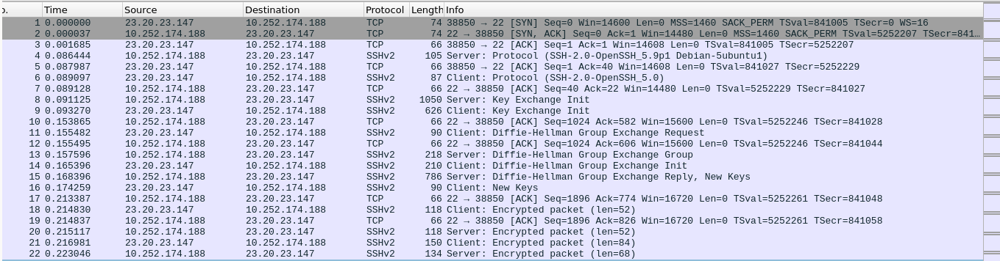
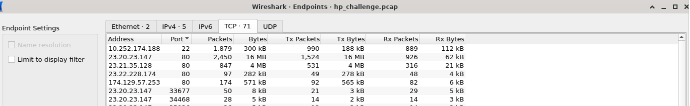
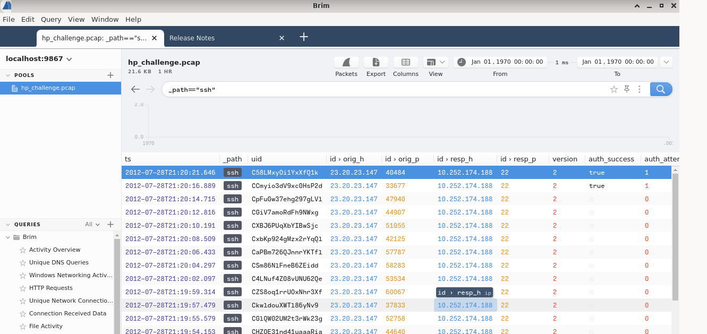
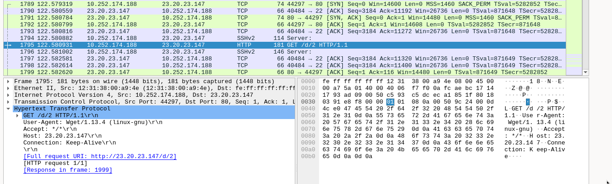
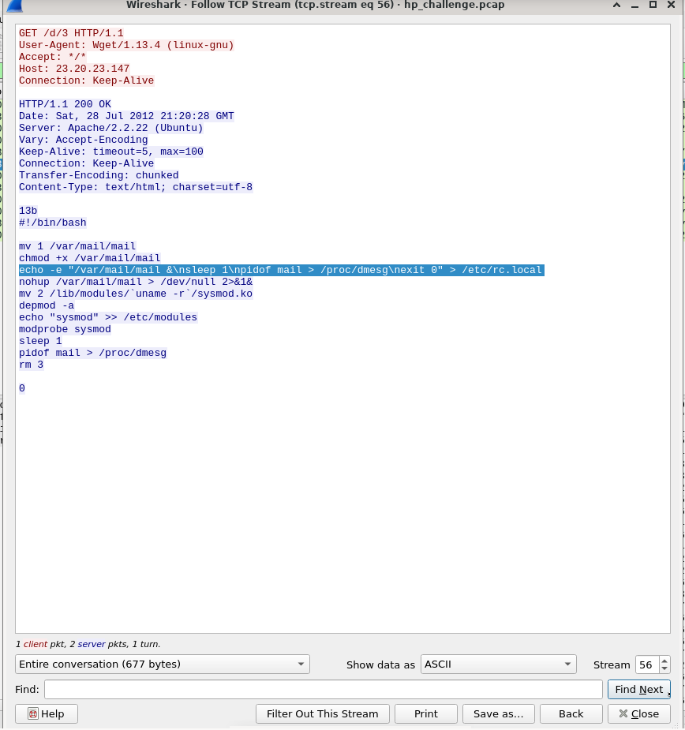

# EscapeRoom Lab— CTF writeup

- Platform: [Cyberdefenders.org](https://cyberdefenders.org/)
- Category: Network Forensics 
- Difficulty: Medium  
- Solver: Nubboss

## Summary
- Scenario:
- You as a soc analyst belong to a company specializing in hosting web applications through KVM-based Virtual Machines. Over the weekend, one VM went down, and the site administrators fear this might be the result of malicious activity. They extracted a few logs from the environment in hopes that you might be able to determine what happened.

- This challenge is a combination of several entry to intermediate-level tasks of increasing difficulty focusing on authentication, information hiding, and cryptography. Participants will benefit from entry-level knowledge in these fields, as well as knowledge of general Linux operations, kernel modules, a scripting language, and reverse engineering. Not everything may be as it seems. Innocuous files may turn out to be malicious so take precautions when dealing with any files from this challenge.


## Artifacts
- Provided files: 18-EscapeRoom.zip → hp_challenge.pcap,ps.log,shadow.log,sudoers.log
- Screenshots: /screenshots/

## Tools & Environment
- OS: Debian VM  
- Tools: Wireshark,Brim,Ghidra,upx  

---

## P.S 


## Q1 What service did the attacker use to gain access to the system?


The first packet in the pcap file shows that someone tried to connect using the SSH protocol.
To confirm this, go to Statistics → Endpoints and look at the ports: only port 22 and port 80 are in use; the other ports are ephemeral.

## A1 SSH


## Q2 What attack type was used to gain access to the system?(one word)

We can see many SSH key exchanges, which means it's a brute‑force attack.
## A2 Bruteforce

## Q3 What was the tool the attacker possibly used to perform this attack?

## A3 hydra


## Q4 How many failed attempts were there?

Go to the Brim and we can use the filter _path == "ssh".
There are 54 packets, of which 2 were successful.



## A4 - 52

## Q5 What credentials (username:password) were used to gain access? Refer to shadow.log and sudoers.log.

(sha512crypt $6$, SHA512 (Unix))
In sudoers.log we can see who has root privileges.

## A5 manager:forgot 

## Q6 What other credentials (username:password) could have been used to gain access also have SUDO privileges? Refer to shadow.log and sudoers.log.

## A6 sean:spectre

## Q7 What is the tool used to download malicious files on the system?

After a successful SSH connection, we can see the wget utility being used.


## Q8 How many files the attacker download to perform malware installation?
Wget uses the HTTP/HTTPS protocols.
In Export Objects → HTTP we can see 3 files and 9 images.
## A8 3

## Q9 What is the main malware MD5 hash?
We can export the files and compute their checksums with md5sum.
```md5sum 1  ```
## A9 772b620736b760c1d736b1e6ba2f885b

## Q10 What file has the script modified so the malware will start upon reboot?
After installing the malware, the attacker executed commands — first they downloaded files in tcp.stream == 54, and later the executed commands appear in tcp.stream == 56.
The file /etc/rc.local is a Unix/Linux startup script that runs user commands at boot.
## A10 /etc/rc.local


## Q11 Where did the malware keep local files?

In the previous Q , we can saw many cmd in /var/mail 

## A11 /var/mail/

## Q12 What is missing from ps.log?

In Q10 we can saw ```nohup /var/mail/mail > /dev/null 2>&1&```
But in ps.log don't .

## A12 /var/mail/mail

## Q13 What is the main file that used to remove this information from ps.log?
sysmod.ko — because as a loaded kernel module it can intercept and modify kernel interfaces (including process listings) to hide entries from ps/logs.
And in Q10 we  saw sysmod.ko

## A13 sysmod.ko

## Q14  Inside the Main function, what is the function that causes requests to those servers?
The mal is compressed 

```bash
./upx -d /home/box/Desktop/EscapeRoom/mal -o mal1
```
Then I used Ghidra.
In Ghidra I found the function requestFile.

## A14 requestFile

## Q15 One of the IP's the malware contacted starts with 17. Provide the full IP.

## A15 174.129.57.253

## Q16 How many files the malware requested from external servers?

In Q8 we have answer
## A16 9

## Q17 What are the commands that the malware was receiving from attacker servers? Format: comma-separated in alphabetical order

## A17 NOP,RUN
